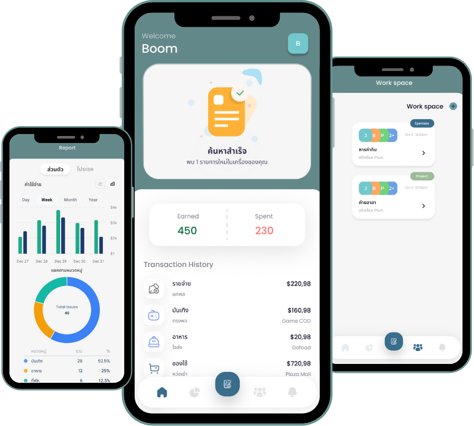

# **คู่มือการใช้งานโปรแกรม FinTrack**

## บทนำและภาพรวมโปรแกรม

**FinTrack** คือแอปพลิเคชันสำหรับจัดการรายรับรายจ่าย แบ่งบิล และติดตามธุรกรรมทางการเงิน เหมาะสำหรับการใช้งานส่วนตัวหรือกลุ่มเพื่อน/ครอบครัว

แอปพลิเคชันนี้ออกแบบมาให้ใช้งานง่าย สามารถบันทึกรายการเงินได้อย่างรวดเร็ว และช่วยให้การแบ่งค่าใช้จ่ายระหว่างกลุ่มเป็นเรื่องที่ไม่ยุ่งยากอีกต่อไป

## ฟีเจอร์หลัก

- **บันทึกรายรับ-รายจ่าย**: เพิ่มบิลหรือรายการใช้จ่ายใหม่
- **แบ่งบิล**: แบ่งบิลแบบเท่ากัน/ไม่เท่ากัน/ปัดเศษ
- **สแกน e-slip**: ใช้สแกน e-slip ในอัลบั้มรูปภาพของธนาคารที่ผู้ใช้งานอนุญาติเพื่อบันทึกธุรกรรมอัตโนมัติ
- **รายงานรายจ่าย**: ดูสรุปและกราฟรายจ่าย
- **จัดการ workspace**: สร้าง/เข้าร่วม workspace สำหรับกลุ่ม
- **ระบบแจ้งเตือน**: รับการแจ้งเตือนเมื่อมีการเพิ่มบิลใหม่หรือมีการแบ่งบิลที่เกี่ยวข้องกับคุณ

## ความต้องการของระบบ

- **ระบบปฏิบัติการ**: Android 8.0+
- **การเชื่อมต่อ**: อินเทอร์เน็ต (สำหรับการซิงค์ข้อมูล)
- **สิทธิ์การใช้งาน**: การเข้าถึงแกลเลอรี่, การแจ้งเตือน

## ขั้นตอนการใช้งานโดยละเอียด

**1. การเข้าสู่ระบบ / สมัครสมาชิก**

1. เปิดแอป FinTrack
2. เลือก "เข้าสู่ระบบ" หากมีบัญชีอยู่แล้ว
   - กรอกเบอร์โทรศัพท์และรหัสผ่าน
   - กดปุ่ม "เข้าสู่ระบบ"
3. หากยังไม่มีบัญชี ให้เลือก "สมัครสมาชิก"
   - กรอกข้อมูลที่จำเป็น (เช่น เบอร์โทรศัพท์, รหัสผ่าน)
   - ยืนยันรหัส OTP ที่ได้รับทาง SMS
   - กด "สมัครสมาชิก" เพื่อสร้างบัญชีใหม่
4. หากลืมรหัสผ่าน เลือก "ลืมรหัสผ่าน" และทำตามขั้นตอนการรีเซ็ตรหัสผ่าน

**2. การสร้างหรือเข้าร่วม Workspace**

1. หลังเข้าสู่ระบบ จะเข้าสู่หน้าหลัก
2. เลือกเมนู "Workspace" หรือ "สร้างกลุ่ม"
3. เลือก "สร้าง Workspace ใหม่"
   - กรอกชื่อกลุ่ม/Workspace
   - เชิญเพื่อนเข้าร่วม (ถ้ามี)
   - กำหนดสิทธิ์การเข้าถึงของสมาชิก (เช่น ผู้ดูแล, ผู้ใช้ทั่วไป)
4. หรือเลือก "เข้าร่วม Workspace" (ผู้ใช้รายอื่นเชิญเข้ามาเป็นสมาชิกแล้ว)

**3. การเพิ่มรายจ่าย/บิลใหม่**

1. ในหน้า บันทึกหรือหน้าหลัก กดปุ่ม "+" หรือ "เพิ่มรายจ่าย"
2. กรอกรายละเอียดบิล
   - ชื่อบิล
   - จำนวนเงิน
   - วันที่
   - หมวดหมู่
3. เลือกวิธีแบ่งบิล
   - แบ่งเท่ากัน (ทุกคนจ่ายเท่ากัน)
   - แบ่งไม่เท่ากัน (กำหนดจำนวนเงินหรือเปอร์เซ็นต์)
   - ปัดเศษ (ระบบช่วยปัดเศษให้อัตโนมัติ)
4. เพิ่มสมาชิกที่เกี่ยวข้องในบิล
5. กด "บันทึก" เพื่อเพิ่มบิล
6. หากต้องการแก้ไขหรือลบบิล ให้กดที่บิลนั้นและเลือก "แก้ไข" หรือ "ลบ"

**4. การสแกน e-slip เพื่อบันทึกธุรกรรม**

1. เมื่อเข้าโปรแกรมครั้งแรก ระบบจะขอสิทธิ์การเข้าถึงแกลเลอรี่ ให้ผู้ใช้อนุญาติ
2. ระบบจะประมวลผลและดึงข้อมูลธุรกรรมให้อัตโนมัติ
3. ตรวจสอบและแก้ไขข้อมูล (ถ้าจำเป็น)
4. กด "หมวดหมู่" เพื่อเพิ่มข้อมูลให้รายจ่ายสมบูรณืมากขึ้น

**5. การดูรายงานและสรุปค่าใช้จ่าย**

1. ไปที่เมนู "รายงาน" หรือ "สรุปค่าใช้จ่าย"
2. เลือกช่วงเวลาที่ต้องการดู (รายวัน/รายเดือน/กำหนดเอง)
3. ดูกราฟสรุป, รายการธุรกรรม, หรือแบ่งตามหมวดหมู่
4. สามารถกรองข้อมูลหรือดูรายละเอียดแต่ละรายการได้
5. กดที่หมวดหมู่หรือช่วงเวลาเพื่อดูรายละเอียดเพิ่มเติม

**6. การตั้งค่าโปรไฟล์และแอป**

1. ไปที่เมนู "โปรไฟล์" หรือ "ตั้งค่า"
2. แก้ไขข้อมูลส่วนตัว, เปลี่ยนรหัสผ่าน
3. ปรับแต่งการแจ้งเตือน (เปิด/ปิด, กำหนดประเภท)
4. ออกจากระบบหากต้องการ

## คำแนะนำและวิธีแก้ปัญหาเบื้องต้น

- หากพบปัญหาในการใช้งาน ให้ตรวจสอบการเชื่อมต่ออินเทอร์เน็ต และสิทธิ์การเข้าถึงกล้อง/ไฟล์
- ปัญหาการสแกน e-slip ไม่ชัด: ถ่ายในที่ที่มีแสงเพียงพอ และวาง e-slip ให้อยู่ในกรอบ
- ข้อมูลไม่อัปเดต: ลองเลื่อนหน้าลงเพื่อรีเฟรช หรือปิดและเปิดแอปใหม่
- ไม่สามารถเพิ่มสมาชิกในบิล: ตรวจสอบว่าสมาชิกอยู่ใน Workspace เดียวกัน
- สามารถดูตัวอย่างโค้ดและโครงสร้างเพิ่มเติมได้ในแต่ละโฟลเดอร์

## คำถามที่พบบ่อย

**Q: สามารถใช้งานแอปโดยไม่มีการเชื่อมต่ออินเทอร์เน็ตได้หรือไม่?**

A: ได้ แต่ข้อมูลจะถูกเก็บไว้ในเครื่องเท่านั้นและจะซิงค์เมื่อมีการเชื่อมต่ออินเทอร์เน็ต

**Q: สามารถกำหนดงบประมาณและได้รับการแจ้งเตือนเมื่อใช้จ่ายเกินได้หรือไม่?**

A: ได้ ไปที่เมนู "ตั้งค่า" > "งบประมาณ" เพื่อกำหนดวงเงินและการแจ้งเตือน

**Q: มีค่าใช้จ่ายในการใช้งานแอปหรือไม่?**

A: ไม่มีค่าใช้จ่ายๆใดๆในการใช้งาน

## ข้อมูลผู้พัฒนา

**จัดทำโดย**

นายเดชาวัฒน์ ร้อยดา

นายไพบูลย์ อาจทวีคูณ

**ติดต่อสอบถามเพิ่มเติม**

อีเมล: paiboon23772@gmail.com

โทรศัพท์: 0937646800

**อัปเดตล่าสุด:** 1 กรกฎาคม 2025
